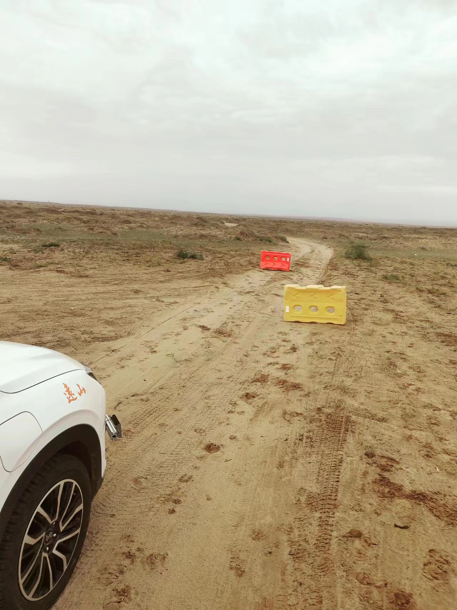
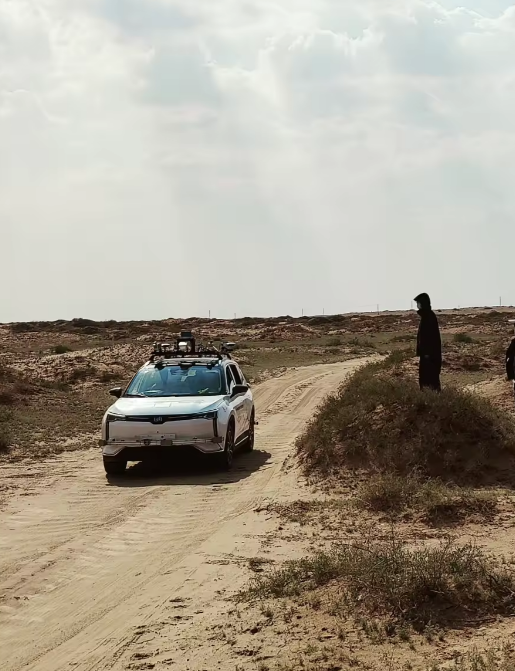

# PCSS-Gobi-3D Dataset

## Introduction to the Gobi Desert Environment

The Gobi Desert, spanning parts of northern China and southern Mongolia, is a vast region characterized by its harsh, arid conditions. The Alxa League in Inner Mongolia, where this dataset was collected, presents a typical segment of the Gobi Desert. This area uniquely combines rocky landscapes, sparse vegetation, and occasional dunes. The environment poses significant challenges for autonomous systems due to its extreme temperatures, rugged terrain, and limited visibility caused by frequent dust storms. These characteristics make the Gobi Desert an ideal location for testing and developing advanced point cloud processing technologies for challenging off-road environments.

<div style="display: flex; justify-content: space-between;">
   
   
   
</div>

## About PCSS-Gobi-3D Dataset

### Overview
PCSS-Gobi-3D is a first-of-its-kind point cloud dataset specifically designed for semantic segmentation tasks in desert off-road environments. Collected in the Alxa League of Inner Mongolia, this dataset offers researchers a unique opportunity to explore and develop domain-adaptive models capable of understanding complex desert terrains.


### Features
- **Diverse Terrain:** Covers the typical terrains in the Gobi Desert, including rocky areas, sandy patches, and vegetative regions.
- **High-Quality Data:** Utilizes high-resolution LiDAR technology to capture detailed 3D representations of the environment.
- **Semantic Annotations:** Each point cloud is meticulously annotated with semantic labels, supporting supervised learning approaches.
- **Off-Road Focus:** Specifically curated for research on the off-road environment, bridging the gap between urban and off-road scene understanding.


### Usage
To utilize the PCSS-Gobi-3D dataset in your research or application development:
1. **Download:** Download link soon to be available.
2. **Data format:** Our data organization method is consistent with the SemanticKITTI dataset(http://www.semantic-kitti.org/).
   
```
├──sequences
        ├── Seq. No./  # new sequence from  PCSS-Gobi-3D Dataset    
        │   ├── velodyne/	 # directory containing ".bin" files with our 128-channel point clouds
        |   |	├── 000000.bin
        |   |	├── 000001.bin
        |   |	└── ...
        │   └── labels/          
        |       ├── 000000.label
        |       ├── 000001.label
        |       └── ...   
     
```

3. **Auxiliary tool:**  The dataset was developed using the open-source tool point_labeler (https://github.com/jbehley/point_labeler), which enables visualization and further editing of the dataset.

<p align="center">
    
</p>

### Code
 The dataset is designed to facilitate research on cross-domain point cloud semantic segmentation. A related study employing this dataset is currently under peer review. Upon completion of the review process and subsequent organization, the corresponding source code will be made publicly available. 


### Contribution
We encourage contributions from the community to enhance this dataset. Whether it involves adding more annotated data, proposing new algorithms, or suggesting improvements, your input is highly valued.

### Contact
For any questions or further information, please get in touch with us at xfy0032@zhejianglab.org or xfy0032@foxmail.com. **Both the dataset and the code will be released free of charge for non-commercial academic research under an appropriate license, to ensure reproducibility and to foster further advancements in the field**.

---

By leveraging the PCSS-Gobi-3D dataset, researchers can advance the field of point cloud semantic segmentation, especially in challenging and less-explored environments like the Gobi Desert. We hope this resource will facilitate groundbreaking work in domain-adaptive model development and beyond.
